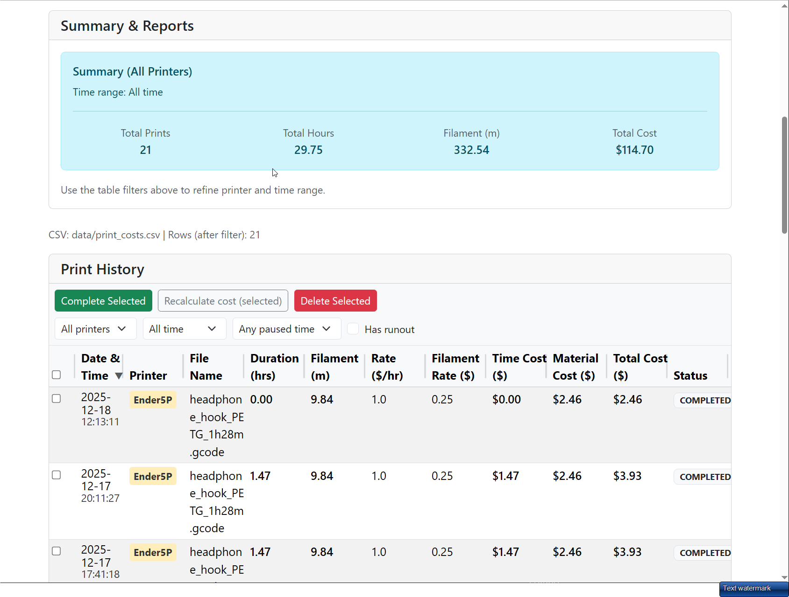
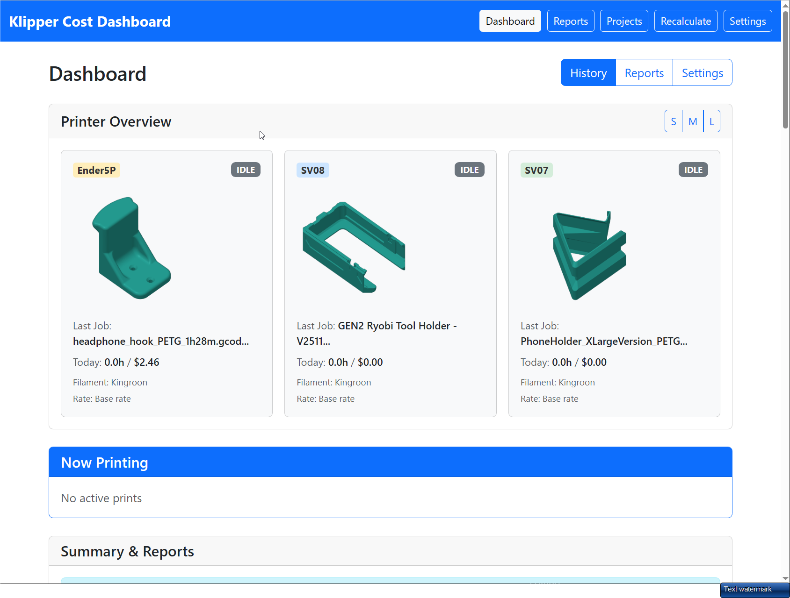
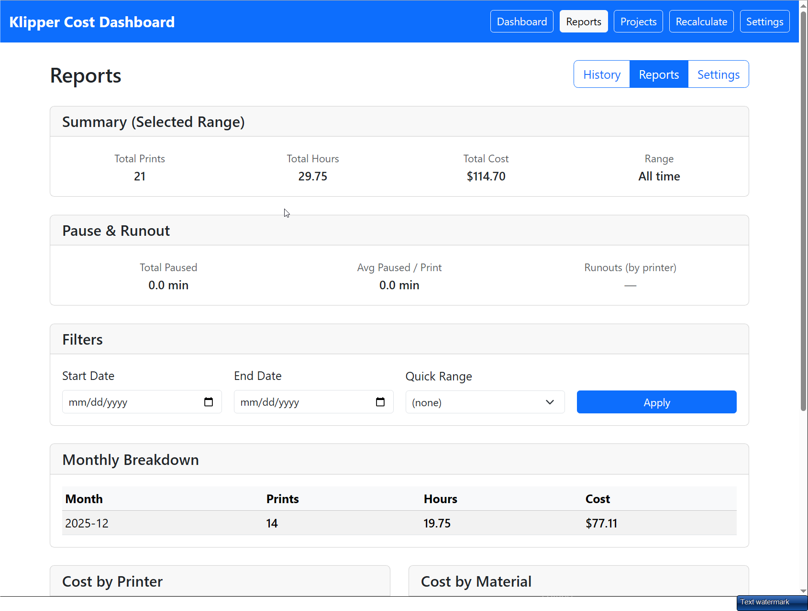
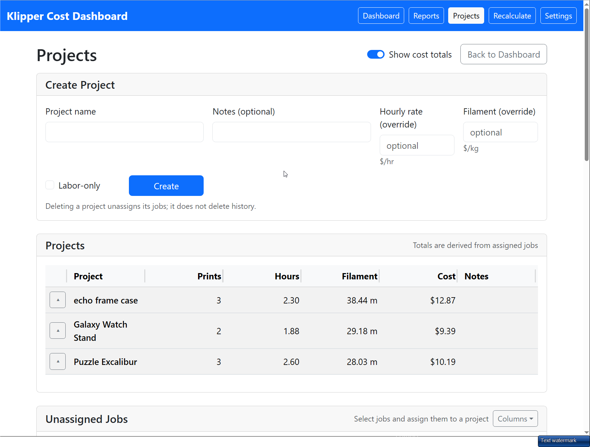
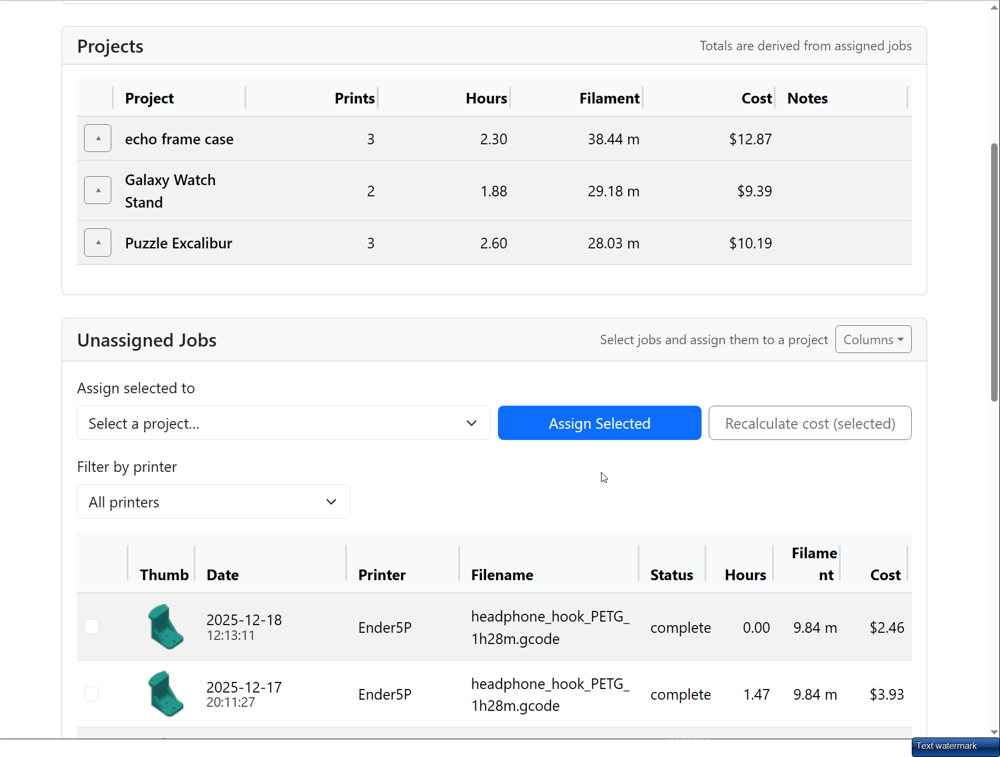
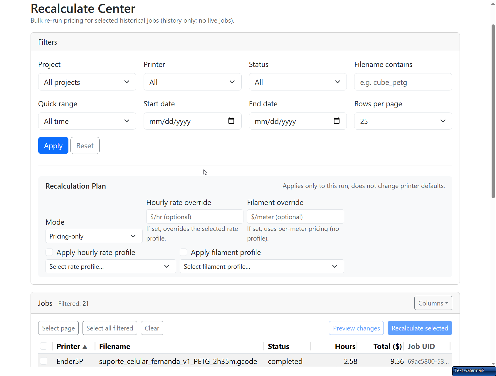
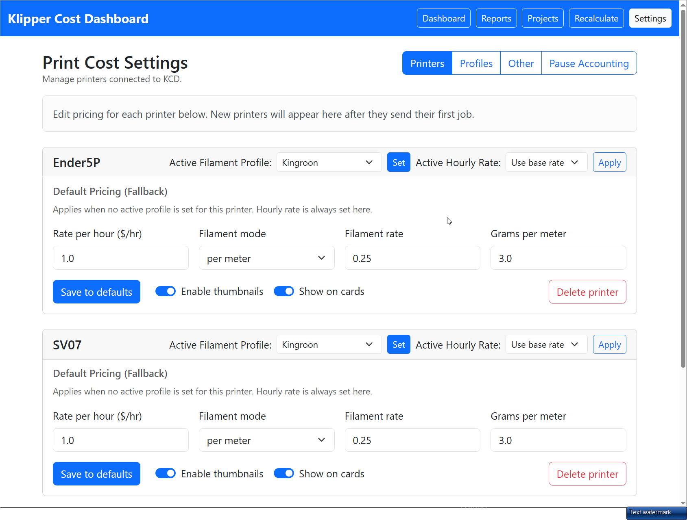
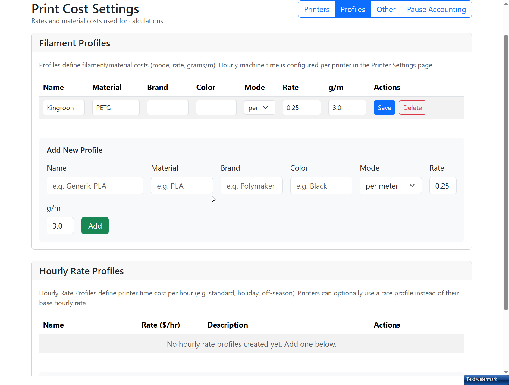
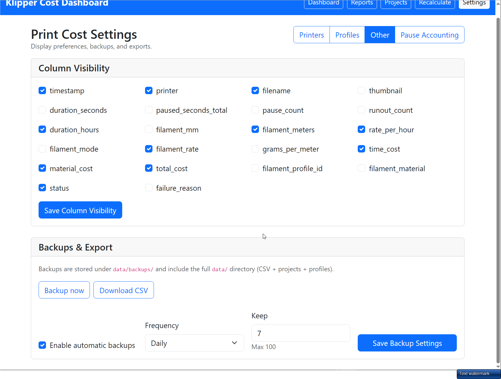
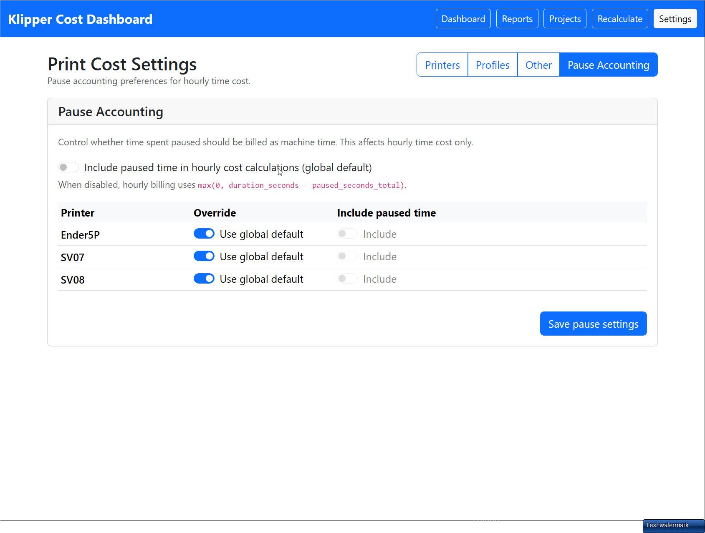

# Klipper Cost Dashboard (KCD)

**Klipper Cost Dashboard** is a self-hosted web dashboard that automatically tracks **time, material, and cost** for Klipper-based 3D printers.

It is designed for makers, print farms, and small shops who want **accurate, auditable print cost data** without spreadsheets, guesswork, or manual tracking.

KCD integrates directly with Klipper via macros, collects data from one or more printers, and presents it in a clean web UI with support for projects, recalculation, and exports.

---

## ✨ Key Features

- 📊 **Automatic print cost tracking**
  - Tracks *actual* print duration and filament usage
  - Supports estimated vs completed jobs
- 🖨️ **Multi-printer support**
  - Local and remote Klipper clients
  - Central “Master” dashboard
- 🧮 **Flexible cost modeling**
  - Hourly rate profiles
  - Filament profiles (cost, density, grams/meter)
  - Per-printer overrides
- 📁 **Projects & batches**
  - Group jobs into projects (orders, builds, commissions)
  - Track totals and projected costs
- 🔁 **Recalculation center**
  - Recalculate historical jobs when pricing changes
  - Safe, previewable bulk operations
- 📤 **CSV export & reporting**
  - For accounting, invoicing, or analysis
- 🛠️ **Installer-driven setup**
  - Interactive installer for master and clients
  - Minimal manual configuration

---

## 🧠 How It Works (High Level)

1. **Klipper macros** report job start/end data (time, filament)
2. **Clients** send that data to the **Master dashboard**
3. KCD stores raw + computed data (CSV + JSON)
4. Costs are calculated using your pricing profiles
5. The web UI lets you review, edit, group, and export jobs

The system is intentionally transparent: raw data is preserved, recalculations are explicit, and nothing is “hidden magic.”

---

## 🧩 Architecture Overview

- **Master**
  - Runs the web dashboard
  - Stores history, settings, and projects
- **Client**
  - Runs on (or connects to) Klipper machines
  - Registers printers and injects macros
- **Data storage**
  - CSV for print history
  - JSON for settings, projects, assignments

This makes KCD easy to back up, inspect, and migrate.

---

## 🚀 Getting Started

> **TL;DR:** Install the master, install clients, print something.

### 1. Install the Master

Run the installer on the machine where you want the dashboard to live.

```bash
git clone https://github.com/<your-org>/klipper-cost-dashboard.git
cd klipper-cost-dashboard
./install.sh
```

### 2. Install Clients

Use the same installer to add:

- A **local client**, or
- A **remote client via SSH**

The installer can auto-detect existing printers and generate the required Klipper macros.

### 3. Print

Once a job runs, it will automatically appear in the dashboard.

---

## 🖥️ Web Interface Highlights

- **Dashboard** – live printer status and current job costs
- **Print History** – sortable, filterable job table
- **Settings** – pricing, filament, and printer configuration
- **Projects** – group and total related jobs
- **Recalculate Center** – bulk recomputation when prices change

---

## 🖼️ Screenshots

### Dashboard (live printers + active job cost)



### Reports (filters + rollups)


### Projects (group jobs into builds/orders)



### Recalculate Center (bulk recompute after pricing changes)


### Settings (Printers / Profiles / Other / Pause Accounting)





---

## ⚠️ Project Status

KCD is **actively developed** and currently used by the author.

- APIs and internal data formats may evolve
- Backward compatibility is considered but not guaranteed yet
- Feedback and early testing are very welcome

This is a great time to:
- Open issues
- Suggest UX improvements
- Sanity-check workflows

---

## 🤖 AI-Assisted Development

Klipper Cost Dashboard was built using OpenAI’s GPT-5.2 as an active development partner, supporting system design, refactoring, documentation, and feature planning throughout the project.
